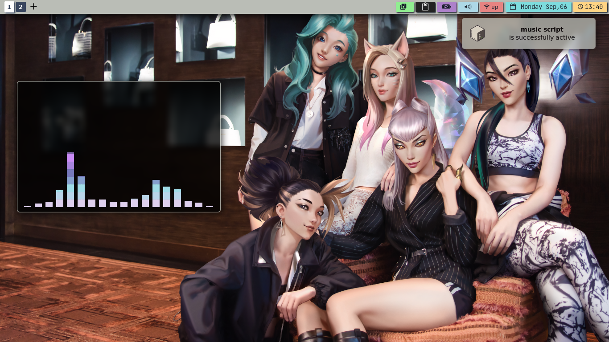
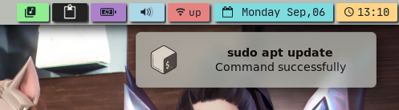
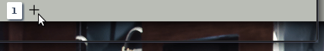

<div align="center">
    <center align="center">
      
    </center>
  <br>
  <h1 align="center"><center>BSPWM Desktop Project</center></h1>
  <br>
</div>

## 🖥️ the full desktop look


## 🧩 xfce4-panel


a group of genmon plugins and xfce4 plugins that display usefull information:
- clock       : a genmon plugin that runs a simple date command.
- current day : xfce4 plugin xfce4-datetime-plugin.
- wifi        : genmon script clickable launch script wifi in my script repository.
- audio       : xfce4 plugin xfce4-pulseaudio-plugin.
- battery     : xfce4 plugin xfce4-power-manager-plugin.
- clipboard   : xfce4 plugin xfce4-clipman-plugin easy way to just have a history of copyed text.
- music       : genmon script clickable launch cava and shows what song is playing and music is from a music script using fzf + mpv.
- add button  : launcher button adds workspace to bspwm using bspc in a bash script:
      
- workspaces  : xfce4 plugin xfce4 workspace switcher:
## 🚧  gtk.css customisation
   this is just an example of what gtk.css looks like:
``` css
#clock-button {
    color: #1b222d;
    font:JetBrainsMono Nerd Font 14;
    background-color: #7ddcdd; 
    border-radius: 2px;
    margin-top:4px;
    margin-bottom:4px;
    padding-left:10px;
    padding-right:10px;
    box-shadow:2px 2px 2px;
    margin-left:2px;
    margin-right:2px;
}
```
this code represents the current date module on the panel and you can check out the [[./theme]] it contains the full thing for dark mode and light mode.
## 🎨 theme switching from light to dark

   
