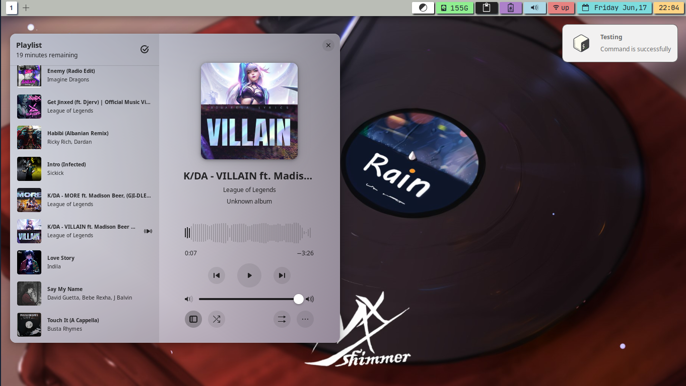
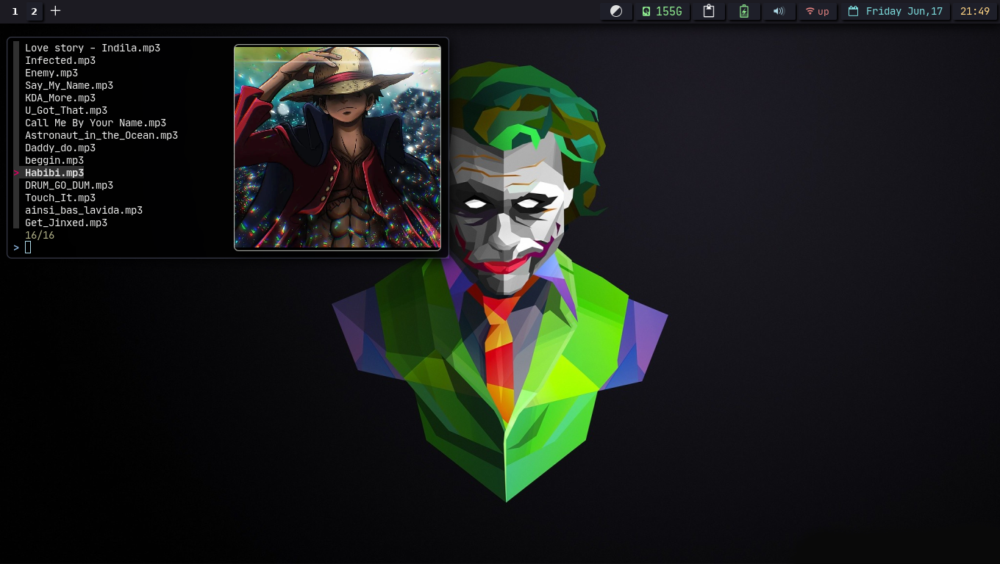
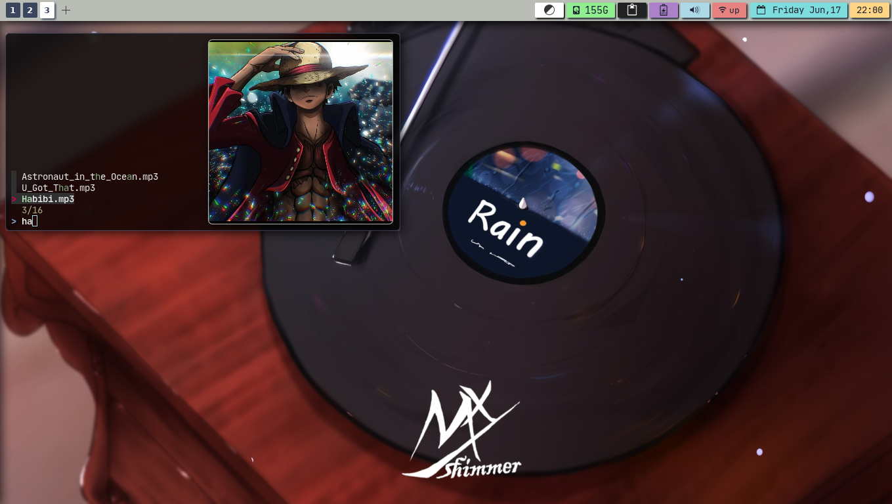

<div align="center">
    <center align="center">
      
       .
        &
        .
      
    </center>
  <br>
  <h1 align="center"><center>Xfce & Bspwm</center></h1>
  <br>
</div>

## 🖥️ the full desktop look
| Xfce                                             | Bspwm                                             |
|:------------------------------------------------:|:-------------------------------------------------:|
|  			       |   			       |
|   			       |  			       |

## 🧩 xfce4-panel & Plugins

- clock       : a genmon plugin that runs a simple date command.
- current day : xfce4 plugin xfce4-datetime-plugin.
- wifi        : genmon script clickable launch script wifi in my script repository.
- audio       : xfce4-pulseaudio-plugin.
- battery     : xfce4-power-manager-plugin.
- clipboard   : xfce4-clipman-plugin easy way to just have a history of copyed text.
- disk size : shows how much space left on the /home folder genmon script clickable.
- Dark/light switcher : a button that executes xfdark/xflight or for bspwm light/dark.
- add workspace button : adds workspaces by executing xfclick/click scripts.
- workspaces : xfce4-workspace-switcher plugin.

## 🚧  gtk.css customisation
   this is just an example of what gtk.css looks like:
``` css
#clock-button {
    color: #1b222d;
    font:JetBrainsMono Nerd Font 14;
    background-color: #7ddcdd; 
    border-radius: 2px;
    margin-top:4px;
    margin-bottom:4px;
    padding-left:10px;
    padding-right:10px;
    box-shadow:2px 2px 2px;
    margin-left:2px;
    margin-right:2px;
}
```
this code represents the current date plugin in the panel.

## 🎨 theme switching from light to dark

- Xfce demo :

https://user-images.githubusercontent.com/62608203/174412186-577cacb3-f179-4d1c-ad7c-533fae69a07c.mp4

- Bspwm demo

https://user-images.githubusercontent.com/62608203/174412288-1a76cdd3-4aa0-4ea6-968c-47ba273db037.mp4

